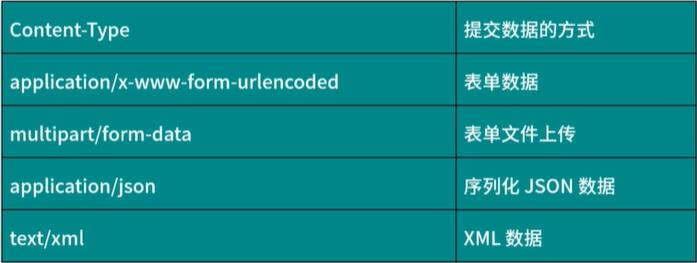

## URI和URL
> URI (Uniform Resource Identifier) 即 **统一资源标志符**  
> URL (Uniform Resource Locator) 即 **统一资源定位符**  

### 例如:
> https://github.com/favicon.ico 既是一个 URL ，也是一个 URI  
即有这样的一个图标资源  
用 URL/URI 来唯一指定了它的访问方式  
这其中包括了访问协议 HTTPS、访问路径（即根目录）和资源名称 favicon.ico  

**URL**是**URI**的一个子集  
**URI**还包括一个子类叫作**URN**(Universal Resource Name) 即**统一资源名称**  
URN 只命名资源而不指定如何定位资源  
比如：  
>urn:isbn:0451450523 指定了一本书的 ISBN，可以唯一标识这本书，但是没法指定到哪里定位这本书  

## 超文本(Hypertext)
浏览器里看到的网页就是超文本解析而成的，其网页源代码即为 **HTML**(HyperTextMarkupLanguage)

## HTTP和HTTPS
https://www.taobao.com/中，URL 的开头会有 http 或 https  
这个就是访问资源需要的协议类型, 有时还可以看到 ftp、sftp、smb 开头的 URL,它们都指的是**协议类型**  

## HTTP (Hyper Text Transfer Protocol)(超文本传输协议)
用于从网络传输超文本数据到本地浏览器的传送协议，**能保证高效而准确地传送超文本文档**  
由万维网协会(World Wide Web Consortium)和Internet 工作小组IETF (Internet Engineering Task
Force)共同合作制定的规范  
目前广泛使用的是HTTP 1.1版本  

## HTTPS (Hyper Text Transfer Protocol over Secure Socket Layer)
是以安全为目标的HTTP通道，简单讲是HTTP的安全版，即HTTP下加入SSL层，简称为HTTPS   
安全基础是SSL，因此通过它传输的内容都是经过SSL加密  
主要作用可以分为两种:  
>建立一个信息安全通道，来保证数据传输的安全
>确认网站的真实性，凡是使用了HTTPS的网站，都可以通过点击浏览器地址栏的锁头标志来查看网站认证之后的真实信息，也可以通过CA机构颁发的安全签章来查询

越来越多的网站和App都已经向HTTPS方向发展
例如:  
>苹果公司强制所有ios App在2017年1月1日前全部改为使用HTTPS加密，否则App就无法在应用商店上架  
>谷歌从2017年1月推出的Chrome 56开始，对未进行HTTPS加密的网址链接亮出风险提示，即在地址栏的显著位置提醒用户“此网页不安全”  
>腾讯微信小程序的官方需求文档要求后台使用HTTPS请求进行网络通信，不满足条件的域名和协议无法请求  

## HTTP请求过程
在浏览器中输入一个URL,回车之后便可以在浏览器中观察到页面内容  
这个过程是浏览器向网站所在的服务器发送了一个请求  
网站服务器接收到这个请求后进行处理和解析，然后返回对应的响应，接着传回给浏览器  

## 请求

### 请求方法
常见的有: GET和POST  
在浏览器中直接输入URL并回车，便发起了一个GET请求，请求的参数会直接包含到URL里  
例如:在百度中搜索Python,这就是一个 GET请求，链接https://www.baidu.com/s?wd=Python  
URL中包含了请求的参数信息，这里参数wd表示要搜寻的关键字  

POST请求大多在表单提交时发起  
例如:对于一个登录表单，输入用户名和密码后，点击“登录” 按钮这通常 会发起一个POST请求  
其数据通常以表单的形式传输，而不会体现在URL中  

GET和POST请求方法有如下区别  
GET 请求中的参数包含在URL里面，数据可以在URL中看到，而POST请求的URL不会包含这些数据  
数据都是通过表单形式传输的，会包含在请求体中GET请求提交的数据最多只有1024字节，而POST请求没有限制  

### 请求头信息
>Accept:请求报头域，用于指定客户端可接受哪些类型的信息  
>Accept-Language:指定客户端可接受的语言类型  
>Accept-Encoding:指定客户端可接受的内容编码  
>Host:用于指定请求资源的主机IP和端口号，其内容为请求URL的原始服务器或网关的位置    

从HTTP 1.1版本开始，请求必须包含此内容

>Cookie:也常用复数形式Cookies,这是网站为了辨别用户进行会话跟踪而存储在用户本地的数据
它的主要功能是维持当前访问会话。例如，我们输入用户名和密码成功登录某个网站后，服务器会用
会话保存登录状态信息，后面我们每次刷新或请求该站点的其他页面时，会发现都是登录状态，这就是Cookies的功劳   
>Cookies里有信息标识了我们所对应的服务器的会话，每次浏览器在请求该站点的页面时，都会在请求头中加上Cookies并将其发送给服务器，服务器通过Cookies识别出是我们自己，并且查出当前状态是登录状态，所以返回结果就是登录之后才能看到的网页内容  
>Referer:此内容用来标识这个请求是从哪个页面发过来的，服务器可以拿到这一-信 息并做相应的处理如做来源统计、防盗链处理等    
>User-Agent:简称UA,它是一个特殊的字符串头， 可以使服务器识别客户使用的操作系统及版本、浏览器及版本等信息。在做爬虫时加上此信息，可以伪装为浏览器;如果不加，很可能会被识别出为爬虫    
>Content-Type:也叫互联网媒体类型(Internet Media Type)或者MIME类型，在HTTP协议消息头中，它用来表示具体请求中的媒体类型信息。例如，text/html 代表HTML格式，image/gif 代表GIF图片，application/json 代表JSON类型,

更多对应关系可以查看此对照表:  
[http://tool.oschina.net/commons](http://tool.oschina.net/commons)   

## 响应
由服务端返回给客户端，可以分为三部分:  
>响应状态码(Response Status Code)  
>响应头(Response Headers)  
>响应体(Response Body)  

### 响应头
响应头包含了服务器对请求的应答信息，如Content-Type、Server、 Set-Cookie 等  
简要说明一些常用的头信息:  
>Date:标识响应产生的时间  
>Last-Modified: 指定资源的最后修改时间  
>Content-Encoding: 指定响应内容的编码  
>Server: 包含服务器的信息，比如名称、版本号等  
>Content-Type: 文档类型,指定返回的数据类型是什么，如text/html代表返回HTML文档
application/x-javascript则代表返回JavaScript文件, image/jpeg则代表返回图片  
>Set-Cookie: 设置Cookies。 响应头中的Set-Cookie告诉浏览器需要将此内容放在Cookies中
下次请求携带Cookies请求。  
>Expires: 指定响应的过期时间，可以使代理服务器或浏览器将加载的内容更新到缓存中
如果再次访问时，就可以直接从缓存中加载，降低服务器负载，缩短加载时间    

### 响应体
最重要的当属响应体的内容,响应的正文数据都在响应体中
比如: .  
>请求网页时，它的响应体就是网页的HTML代码  
>请求一张图片时，它的响应体就是图片的二进制数据  

### 视频地址(付费)：[HTTP原理](https://kaiwu.lagou.com/course/courseInfo.htm?courseId=46#/detail/pc?id=1662)